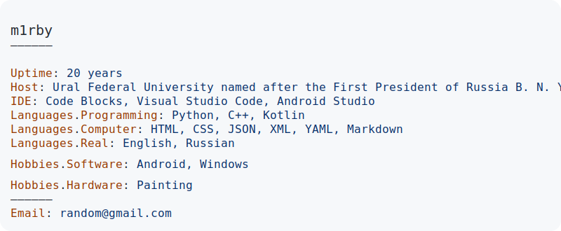

<a href="https://github.com/m1rby/m1rby">
  <picture>
    <source media="(prefers-color-scheme: dark)" srcset="dark_mode.svg">
    
  </picture>
  
  
</a>
### Languages and tools

  &nbsp;
  &nbsp;
  &nbsp;
  &nbsp;
  &nbsp;
  &nbsp;
  &nbsp;
  &nbsp;
  &nbsp;
  &nbsp;

